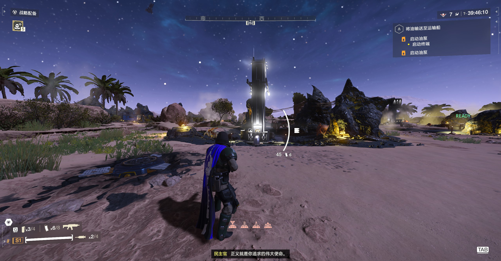
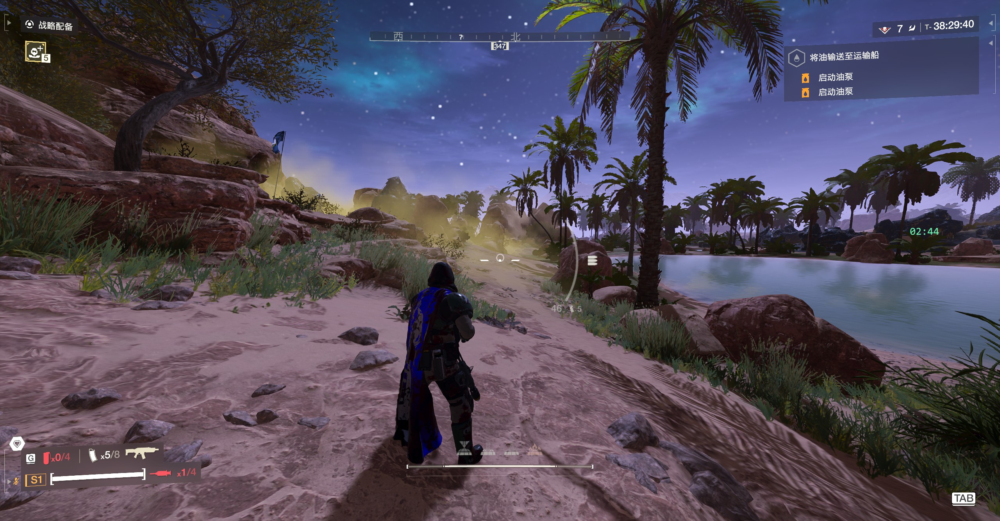
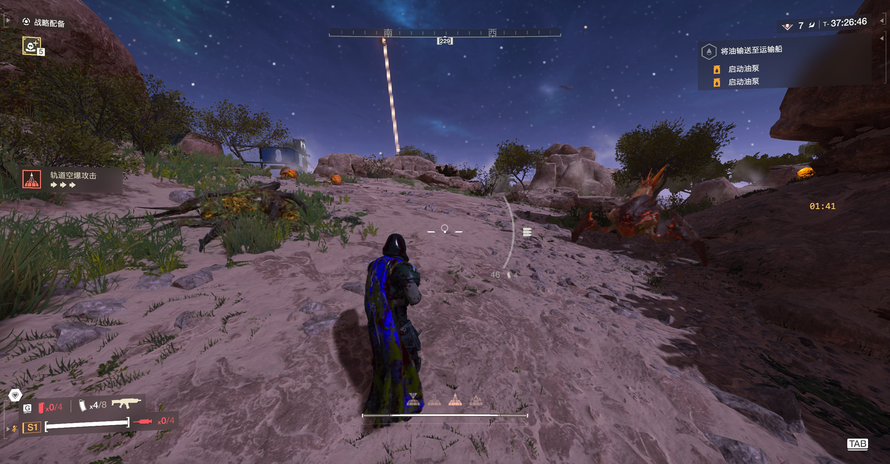
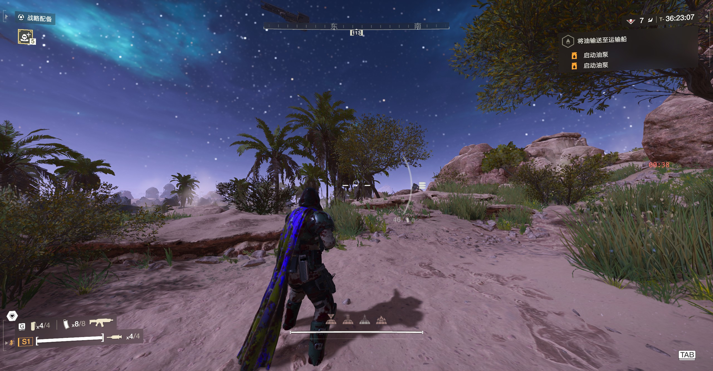
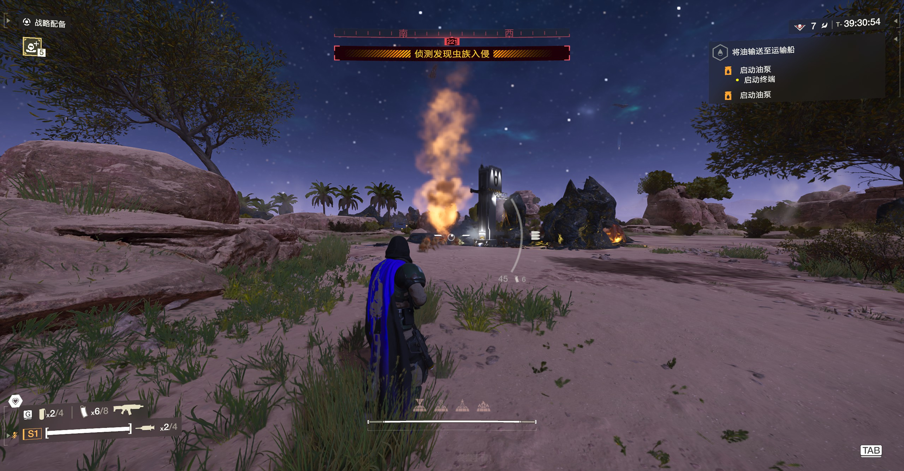

# Reinforcement Radar

在《绝地潜兵 2》任务中显示敌人增援冷却状态与倒计时。

只读，不修改游戏内存，不影响其他玩家。

**[English](README.en.md)**

---

## 目录

- [依赖](#依赖)
- [安装](#安装)
- [使用效果](#使用效果)
- [显示逻辑](#显示逻辑)
- [调整位置与大小](#调整位置与大小)
- [日志](#日志)
- [文档](#文档)
- [关于维护](#关于维护)

## 依赖

- **Bingus Shared Loader** v15 或更新（API 1）
- 支持 Steam 构建 **25480438** / EXE 1.8.46015.0

## 安装

1. 关闭游戏
2. 用 Arsenal 或 HD2MM 导入 `Reinforcement-Radar-*.zip`
3. 启用，Purge / Deploy
4. 与 Bingus Shared Loader 同时启用（只开其中一个不起作用）

## 使用效果

### 可以拉烟

冷却清零时显示绿色 `READY`。



### 冷却中，剩余 2 分钟以上

绿色倒计时。



### 冷却中，剩余 1–2 分钟

转为橙色。



### 冷却中，剩余不到 1 分钟

转为红色。



### 增援进行中

增援期间游戏会冻结共享冷却，此时面板整体隐藏——那一刻显示倒计时会误导。



## 显示逻辑

面板固定在屏幕右侧、偏上的位置，没有背景板，文字直接绘制在画面上。

| 状态 | 显示 | 颜色 |
| --- | --- | --- |
| 可以拉烟 | `READY` | 绿 |
| 冷却中，剩余 2 分钟以上 | `MM:SS` | 绿 |
| 冷却中，剩余 1–2 分钟 | `MM:SS` | 橙 |
| 冷却中，剩余不到 1 分钟 | `MM:SS` | 红 |
| 增援进行中 | 不显示 | — |
| 不在任务中 | 不显示 | — |

## 调整位置与大小

参数集中在 `src/hud.lua` 顶部的 `LAYOUT`，改一个数字即可。启动时日志会记录一次实际布局，方便按分辨率核对：

```
# HUD layout: screen=2560x1334 scale=1.235 panel=212x49 at 2317,724
```

## 日志

`%LOCALAPPDATA%\CowboyBingus\Helldivers2\Logs\ReinforcementRadar.log`

## 文档

- [技术说明](docs/TECHNICAL.md) —— 架构、坐标系、只读保证
- [维护指南](docs/MAINTENANCE.md) —— 游戏更新后如何重新适配、日志怎么读

## 关于维护

作者由于学业原因可能无法长期维护本项目，希望社区能够共同维护。

本项目由 DeepSeek V4.1 Flash 参与开发。
